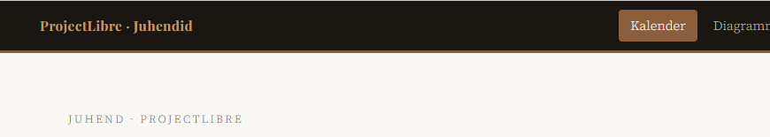
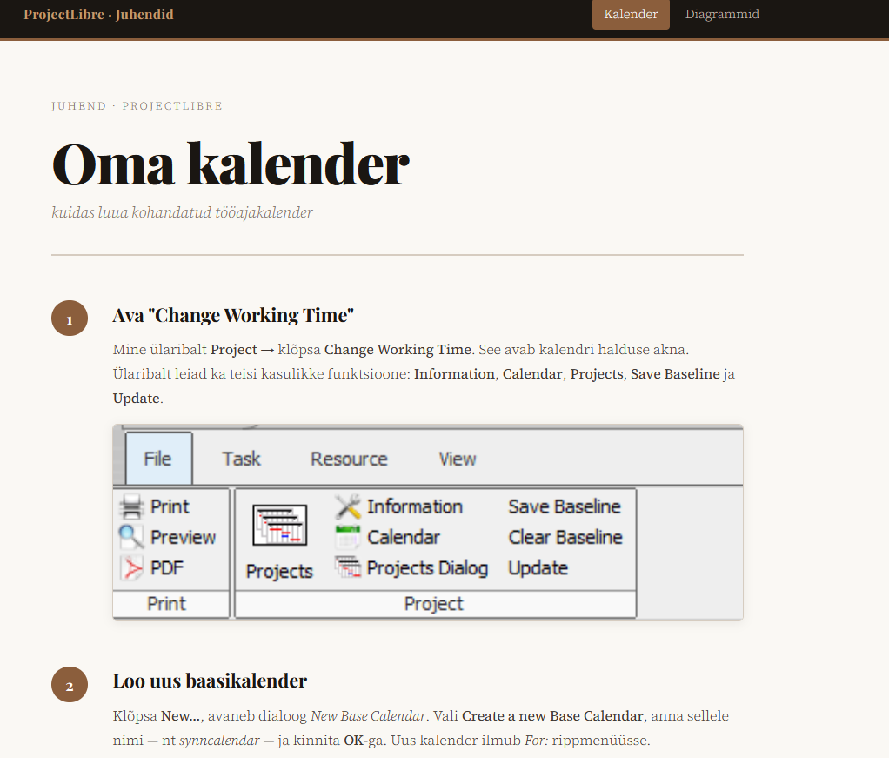
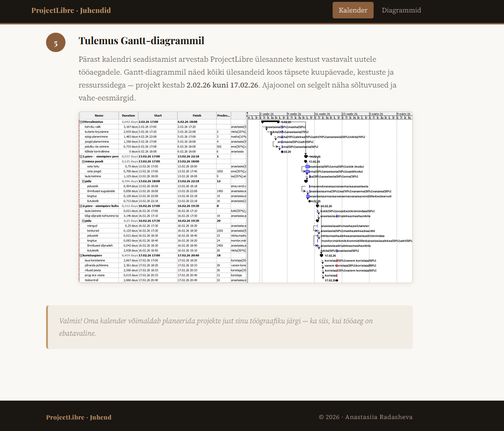
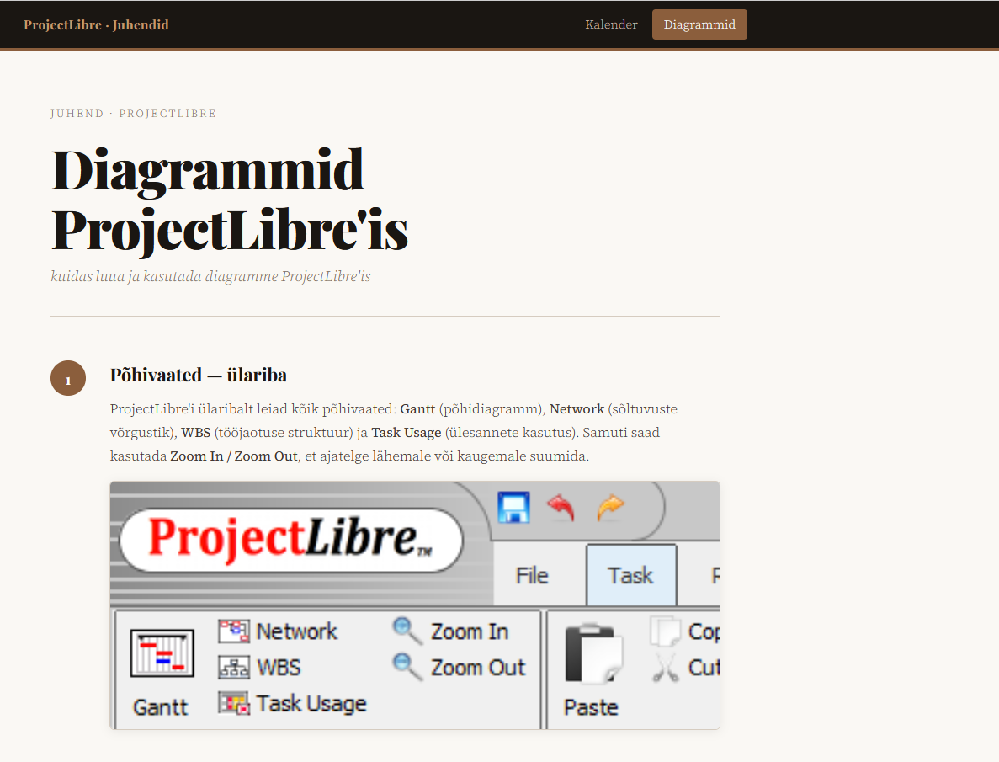

# ProjectLibre Juhendid — GitHub Pages

> Õpetlik veebileht, mis selgitab samm-sammult, kuidas kasutada **ProjectLibre'i** peamisi funktsioone: kohandatud tööajakalendrite loomist ja erinevate diagrammide kasutamist.

---

## Live sait

> [!IMPORTANT]
> Ava veebileht:  
> https://anastasiiaradasheva.github.io/GITHUB-pages/

---

## Ekraanipildid

### Navigatsioon

### Kalender — index.html

### Diagrammid — diagramm.html

---

## Lehed

| Leht | Fail | Kirjeldus |
|------|------|-----------|
| Kalender | `index.html` | Kuidas luua kohandatud tööajakalender ProjectLibre'is |
| Diagrammid | `diagramm.html` | Kuidas luua ja kasutada diagramme ProjectLibre'is |

---

## Sisu ülevaade

### Kalender (`index.html`)

> [!NOTE]
> Juhend selgitab 5 sammuga, kuidas luua kohandatud tööajakalender ja määrata see ülesannetele.

1. Avada **Change Working Time** akna (`Project → Change Working Time`)
2. Luua uus baasikalender (nt `synncalendar`)
3. Seadistada kohandatud tööajad (nt 17:00–23:00)
4. Määrata kalender konkreetsele ülesandele läbi **Task Information → Advanced**
5. Vaadata tulemust Gantt-diagrammil

---

### Diagrammid (`diagramm.html`)

> [!IMPORTANT]
> Juhend tutvustab erinevaid diagramme ja vaateid ProjectLibre'is.

1. **Põhivaated** — Gantt, Network, WBS, Task Usage ülaribalt
2. **Projects tabel** — projekti üldandmed (kulu, maht, kuupäevad)
3. **Project Information** — projekti kokkuvõttev aruanne
4. **Network** — ülesannete sõltuvuste diagramm
5. **Sub-views** — Histogram, Charts, Resource Usage
6. **Gantt ressurssidega** — ressursid ja koormusprotsendid ajajoonel

---

## Tehnoloogiad

- **HTML5** — lehtede struktuur
- **CSS3** — kujundus ja paigutus (`style.css`)
- **Google Fonts** — Playfair Display + Source Serif 4
- **GitHub Pages** — automaatne avaldamine

---

## Autor

**Anastasiia Radasheva**  
© 2026 · Tallinn
