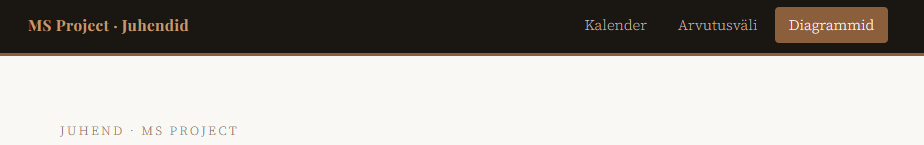
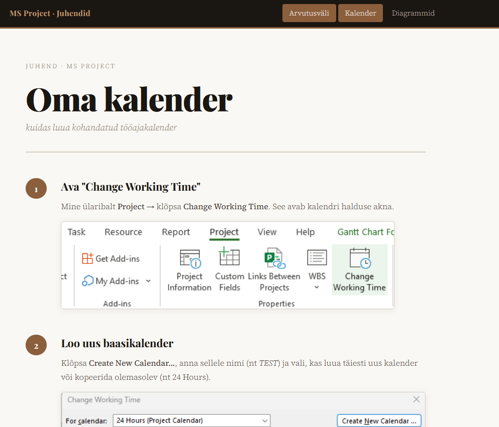
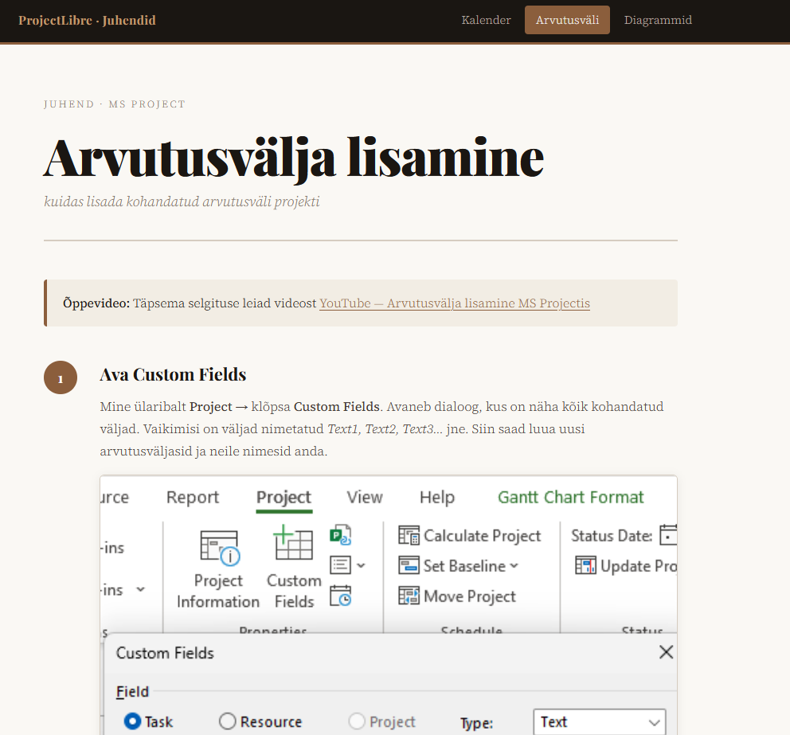
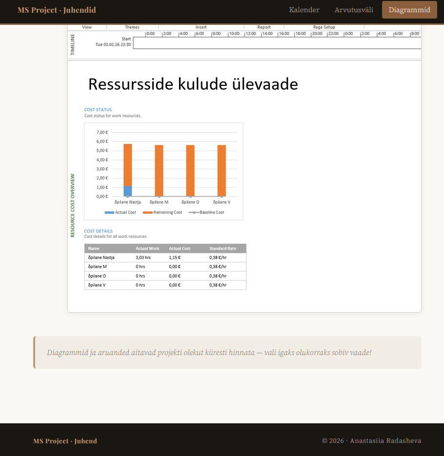
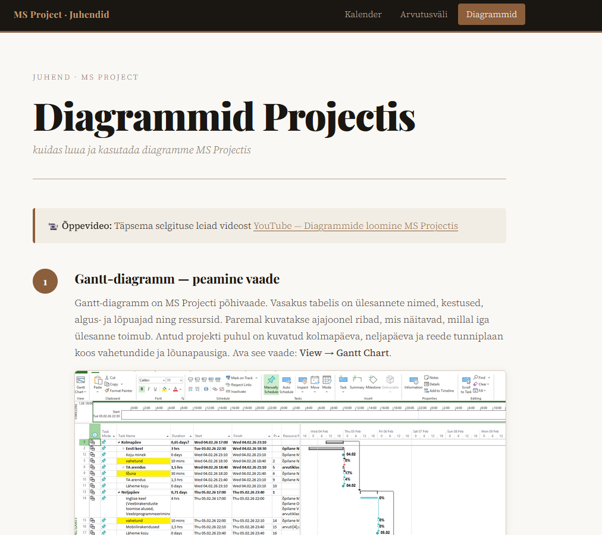

# MS Project Juhendid — GitHub Pages

Õpetlik veebileht, mis selgitab samm-sammult, kuidas kasutada **MS Projecti** peamisi funktsioone.

---

## Live sait

> [!IMPORTANT]
> Ava veebileht:
> https://anastasiiaradasheva.github.io/GITHUB-pages/

---

## Ekraanipildid

### Navigatsioon



### Kalender — index.html



### Arvutusväli — valem.html



### Diagrammid — diagramm.html





---

## Lehed

| Leht        | Fail            | Kirjeldus                 |
| ----------- | --------------- | ------------------------- |
| Kalender    | `index.html`    | Kohandatud tööajakalender |
| Arvutusväli | `valem.html`    | Kohandatud väli valemiga  |
| Diagrammid  | `diagramm.html` | Diagrammid ja aruanded    |

---

## Sisu ülevaade

### Kalender (`index.html`)

> [!NOTE]
> Kohandatud tööaja seadistamine projektis.

* Avada:

  ```text
  Project → Change Working Time
  ```
* Luua uus kalender (`TEST`)
* Muuta tööaegu
* Lisada:

  ```text
  Exceptions
  ```
* Tulemus Gantt-diagrammil

---

### Arvutusväli (`valem.html`)

> [!TIP]
> Võimaldab automatiseerida andmete arvutamist.

* Avada:

  ```text
  Project → Custom Fields
  ```
* Muuta nimi (`Text1 → arvutusklass`)
* Lisada valem:

  ```text
  Formula
  ```
* Seadistada:

  ```text
  Graphical Indicators
  ```

---

### Diagrammid (`diagramm.html`)

> [!IMPORTANT]
> Visualiseerimine aitab projekti paremini analüüsida.

* Vaated:

  ```text
  View → Gantt Chart
  ```

* Aruanded:

  * Dashboards
  * Resources
  * Costs
  * In Progress

* Resource Cost Overview

* Timeline:

  ```text
  View → Timeline
  ```

* Report Design:

  ```text
  Chart | Table | Themes
  ```

---

## Task list

* [x] Kalenderi juhend
* [x] Arvutusvälja juhend
* [x] Diagrammide juhend
---

## Tehnoloogiad

| Tehnoloogia  | Kasutus     |
| ------------ | ----------- |
| HTML5        | Struktuur   |
| CSS3         | Kujundus    |
| Google Fonts | Tüpograafia |
| GitHub Pages | Avaldamine  |

---


## Autor

**Anastasiia Radasheva**
© 2026 · Tallinn
